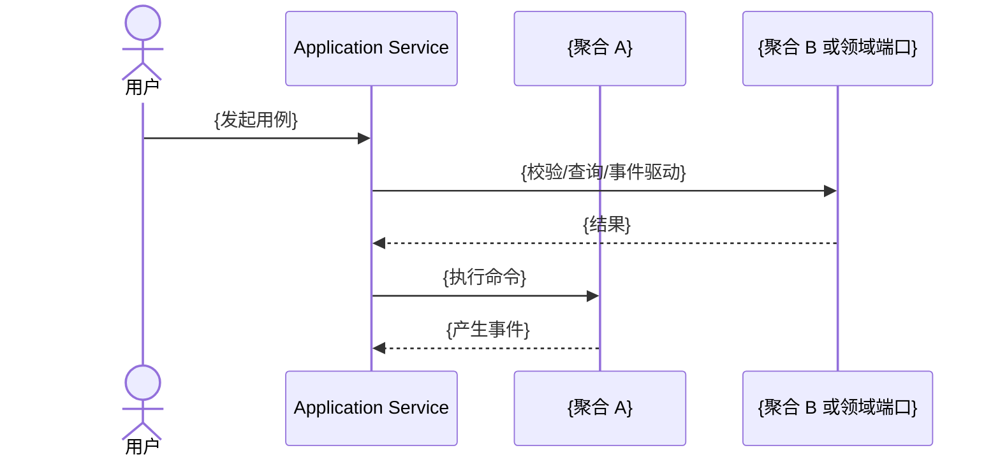

# DDD 建模文档结构契约

> 本 skill 统一维护四份建模文档的结构模板、字段约束和章节归属。`ddd-architect` 负责在阶段 5 基于本契约落盘，不再在 agent 文档中内嵌完整模板。

## 适用范围

- 首次创建 `docs/ddd/` 下的四份建模文档
- 调整四份文档的章节结构、字段约束和归档位置
- 校验建模结果是否写入了正确文档
- 多子域增量建模时，统一约束章节追加方式

## 关键职责边界

- `domain-model.md` **只**表达纯领域语义：事件、命令、聚合状态机、不变量、领域服务、聚合间协作。不表达并发策略、锁实现选型、重试语义。
- `application-model.md` **全部**表达运行时语义：用例编排、事务边界、一致性要求、并发冲突语义、并发控制方案、读模型清单。
- 两份文档的交叉点：`domain-model.md` 声明 `version` 字段存在 → `application-model.md` 负责如何使用 `version` 去实现乐观并发。

## 文件清单

- `docs/ddd/domain-discovery.md`
- `docs/ddd/domain-decisions.md`
- `docs/ddd/domain-model.md`
- `docs/ddd/application-model.md`

## 内容归属矩阵

本矩阵用于自动验收建模产物是否写入了正确文档。每类内容只能有一个主归属文档；其他文档如需引用，只能写摘要或引用关系，不重复维护完整定义。

| 内容项 | 必须写入文档 | 必须章节 / 位置 | 不应写入 | 验收规则 |
|--------|--------------|----------------|----------|----------|
| 需求澄清问题、用户回答、澄清后的建模结论 | `domain-discovery.md` | `## 0. 需求澄清记录` | `domain-model.md`、`application-model.md` | 每个问题必须有优先级、状态和建模结论 |
| 业务术语、同义词、上下文含义 | `domain-discovery.md` | `## 1. 业务术语` | `domain-model.md` | 每个术语必须有业务说明，不能只给代码名 |
| 参与者与外部系统 | `domain-discovery.md` | `## 2. 参与者与外部系统` | `domain-model.md` 的聚合章节 | 必须区分 `Actor` 与 `ExternalSystem` |
| 领域事件发现清单 | `domain-discovery.md` | `## 3. 领域事件清单` | `application-model.md` | 用完成时态命名，并标注业务含义和前置事件 |
| 领域命令发现清单 | `domain-discovery.md` | `## 4. 领域命令清单` | `application-model.md` | 必须包含触发者、输入数据、前置条件和产生事件 |
| 候选 Policy | `domain-discovery.md` | `## 5. 候选 Policy 清单` | `application-model.md` | 标明监听事件、触发命令和是否有状态 |
| 待确认问题 | 来源文档对应章节 | 各文档 `待确认问题` 章节 | 最终基线正文 | 必须保留编号、来源阶段、影响决策和状态 |
| 纯领域模型收敛记录 | `domain-decisions.md` | `## 1. 决策摘要` 或 `## 2. 聚合与边界决策` | `application-model.md` | 记录候选业务对象、生命周期、规则归属、状态所有权的决策依据 |
| 聚合边界决策 | `domain-decisions.md` | `## 2. 聚合与边界决策` | `application-model.md` | 必须包含候选方案、最终结论、决策理由和影响对象 |
| 规则归属决策 | `domain-decisions.md` | `## 3. 规则归属决策` | `application-model.md` | 必须明确归属为命令前置条件、聚合不变量、Policy 或待确认 |
| 应用编排决策依据 | `domain-decisions.md` | `## 4. 应用编排决策` | `domain-model.md` | 只记录为什么这样决策，完整用例编排写入 `application-model.md` |
| 被否决方案和权衡理由 | `domain-decisions.md` | 对应决策条目 | `domain-model.md`、`application-model.md` | 最终基线不得保留被否决方案 |
| 最终领域事件定义 | `domain-model.md` | `## 1. 领域事件清单` | `domain-discovery.md` 的最终基线之外 | 必须包含类名、所属聚合、业务含义和字段定义 |
| 最终领域命令定义 | `domain-model.md` | `## 2. 领域命令清单` | `application-model.md` | 总览必须包含目标聚合、命令类型、产生事件；输入模型和前置条件写入命令详情 |
| 最终 Policy 定义 | `domain-model.md` | `## 3. Policy 清单` | `application-model.md` | 有状态 Policy 必须标注，普通 Policy 不得承载 Saga 细节 |
| 聚合设计 | `domain-model.md` | `## 4. 聚合设计` | `application-model.md` | 必须包含聚合根、聚合 ID、命令-事件映射（形如 `C1 → E1`，简单表达每条命令在该聚合上产生的事件）、状态数据（含 `version` 等并发令牌字段以及其用途说明）、不变量、领域服务 / 端口 |
| `version` / `etag` 等并发令牌字段声明 | `domain-model.md` | 聚合内部状态数据 | `application-model.md` | 只在状态字段表中说明“用于乐观并发控制”，不在 domain-model.md 设计并发策略 |
| 聚合状态机与业务状态约束（如“账号锁定期间不可登录”） | `domain-model.md` | 聚合不变量 | `application-model.md` | 作为聚合不变量保留，不单独抽为“业务锁规则”独立字段 |
| 并发语义、乐观并发令牌方案、分布式锁选型 | `application-model.md` | `## 6. 聚合并发约束` | `domain-model.md` | 每个可写聚合必须声明 `必须串行化 / 允许冲突失败重试 / 只读并发`，并明确实现方案（仓储锁定读取 / Redis 分布式锁 / 全表串行 等） |
| 领域协作约束 | `domain-model.md` | `## 5. 聚合协作视图` | `application-model.md` 的运行时编排章节之外 | 只记录聚合间允许的协作方式、禁止事项和领域层约束 |
| 应用服务清单 | `application-model.md` | `## 2. 应用服务清单` | `domain-model.md` | 每个服务必须关联负责用例和依赖的领域公开入口 |
| 用例清单与命令编排 | `application-model.md` | `## 3. 用例清单` | `domain-model.md` | 必须包含请求模型、返回模型、领域入口、命令序列和事务边界 |
| 外部协作类型、执行方式、失败语义 | `application-model.md` | `## 3. 用例清单` 或 `## 7. 应用编排约束` | `domain-model.md` | 每个用例必须声明 `无 / 本地调用 / 远程查询 / 远程写入`、`同步编排 / 提交后事件 / Saga` 和失败语义 |
| 应用层并发冲突语义 | `application-model.md` | `## 3. 用例清单` | `domain-model.md` | 每个可写用例必须声明 `失败返回 / 有限重试 / 排队串行 / 人工介入`，必须与 `## 6. 聚合并发约束` 中声明的并发语义一致 |
| 请求模型 Req | `application-model.md` | `## 4. 请求模型` | `domain-model.md` | 字段必须来自用例输入，不从聚合字段反推 |
| 返回模型 DTO | `application-model.md` | `## 5. 返回模型` | `domain-model.md` | 必须标注字段来源：命令结果、聚合状态或读模型 |
| 读模型清单与状态声明 | `application-model.md` | `## 8. 读模型清单` | `domain-model.md` | 如果本子域无独立读模型，必须显式声明“无读模型”；有读模型时必须包含查询场景、数据来源事件、更新时机、存储方式和关键字段 |
| 技术实现方案、框架注解、MQ / Outbox 具体实现 | 不进入建模基线 | 可在实现设计文档另行维护 | 四份 DDD 建模文档 | DDD 建模文档只记录语义约束，不记录具体技术实现 |
| 迭代标记（新）（改） | 临时阶段输出 | 不进入最终基线 | `domain-model.md`、`application-model.md` | 最终落盘前必须去除，仅保留最终状态 |

## 结构约束

### 多子域文档组织策略

- **单子域项目**：直接使用统一文档
- **多子域项目**：采用**统一文档内按子域分章节**
- 所有子域的建模结果写入同一份文档
- 在文档内按子域划分章节
- 不创建带子域前缀的独立文档
- 文档头部的“当前覆盖子域”列表需要同步更新

### 最终基线去噪规则

- `domain-model.md` 和 `application-model.md` 中不保留（新）（改）标记
- `domain-model.md` 和 `application-model.md` 中不保留被否决方案
- 已确认问题保留结论与状态，未确认问题保留为“待确认”

### 数据拥有权约束

- `domain-model.md` 模板中不再单列 `5.4 数据拥有权` 小节
- 若需要表达数据归属、状态归属或使用边界，优先合并写入边界决策说明、协作原则或应用编排说明，避免再恢复独立模板章节

### 并发语义归属约束

- `domain-model.md` 仅记录并发令牌字段本身（如 `version`）及其用途说明，不重复定义并发策略。
- 并发语义本身（必须串行化 / 允许冲突失败重试 / 只读并发）、并发令牌方案、是否引入分布式锁及冲突处理机制，由 `application-model.md` `## 6. 聚合并发约束` 统一维护。
- “业务锁”归为聚合状态机的一部分，写入 `domain-model.md` 聚合不变量；不在任何文档中单独抽为“业务锁规则”主项。

## 模板：`docs/ddd/domain-discovery.md`

```markdown
# 领域发现记录

> 最后更新：{日期}
> 需求摘要：{一句话描述}

## 0. 需求澄清记录

### 澄清问题 1：{问题类型}
- **位置**：需求第 X 段 / 整体需求
- **问题描述**：{具体问题}
- **追问**：{结构化追问内容}
- **用户回答**：{用户的回答}
- **建模结论**：{基于回答得出的建模决策}
- **优先级**：高/中/低
- **状态**：已回答/待回答/已跳过

## 1. 业务术语
| 术语 | 说明 |
|------|------|
| ...  | ...  |

## 2. 参与者与外部系统
| 编号 | 名称 | 类型 | 说明 |
|------|------|------|------|
| A1   | ...  | Actor/ExternalSystem | ... |

## 3. 领域事件清单
| 编号 | 事件名称 | 类名 | 业务含义 | 前置事件 |
|------|---------|------|---------|---------|
| E1   | ...     | ...Event | ...     | ...     |

## 4. 领域命令清单
| 编号 | 命令名称 | 类名 | 触发者 | 输入数据 | 前置条件 | 产生事件 |
|------|---------|------|--------|---------|---------|---------|
| C1   | ...     | ...Command | ...    | ...     | ...     | ...     |

## 5. 候选 Policy 清单
| 编号 | 策略名称 | 类名 | 监听事件 | 触发命令 | 业务规则描述 | 是否有状态 |
|------|---------|------|---------|---------|-------------|-----------|
| P1   | ...     | ...Policy | ...     | ...     | ...         | ...       |

## 6. 待确认问题
| 编号 | 问题描述 | 来源阶段 | 状态 |
|------|---------|---------|------|
| Q1   | ...     | 阶段 1/2/3 | 待确认/已确认 |
```

## 模板：`docs/ddd/domain-decisions.md`

```markdown
# 领域建模决策记录

> 最后更新：{日期}
> 需求摘要：{一句话描述}

## 1. 决策摘要
| 编号 | 决策主题 | 结论 | 影响范围 | 状态 |
|------|---------|------|---------|------|
| D1   | ...     | ...  | ...     | 已确认 |

## 2. 聚合与边界决策
### D1：{决策主题}
- 触发信号：{为什么需要做这个决策}
- 候选方案：{方案列表}
- 最终结论：{采用的方案}
- 决策理由：{为什么这样划分边界}
- 并发语义：{必须串行化 / 允许冲突失败重试 / 只读并发 / 待确认}
- 业务锁：{无 / 有，规则如下}
- 影响对象：{事件/命令/聚合}

## 3. 规则归属决策
### D2：{决策主题}
- 规则内容：{规则}
- 归属：命令前置条件 / 聚合不变量 / 待确认
- 决策理由：{原因}

## 4. 应用编排决策
### D3：{决策主题}
- 用例：{用例名称}
- 领域入口：{调用哪些领域公开入口}
- 一致性要求：强一致 / 最终一致 / 待确认
- 并发冲突语义：失败返回 / 有限重试 / 排队串行 / 人工介入 / 待确认
- 决策理由：{原因}

## 5. 实现约束备注（可选）
- {仅记录语义层约束，不写技术方案}
```

## 模板：`docs/ddd/domain-model.md`

````markdown
# 领域模型设计文档

> 最后更新：{日期}
> 需求摘要：{一句话描述}
> 限界上下文/子域：{上下文名称}

## 1. 领域事件清单
| 编号 | 事件名称 | 类名 | 所属聚合 | 业务含义 | 前置事件 |
|------|---------|------|---------|---------|---------|
| E1   | ...     | ...Event | ...   | ...     | ...     |

### 1.1 事件字段：{事件类名}
| 字段名 | 类型 | 含义 |
|--------|------|------|
| ...    | ...  | ...  |

## 2. 领域命令清单
| 编号 | 命令名称 | 类名 | 触发者 | 目标聚合 | 命令类型 | 前置条件 | 产生事件 |
|------|---------|------|--------|---------|---------|---------|---------|
| C1   | ...     | ...Command | ... | ...     | 创建型/操作型 | 见详情 | ... |

### 2.1 命令详情：{命令类名}

#### 输入模型
| 参数名 | 类型 | 含义 |
|--------|------|------|
| ...    | ...  | ...  |

#### 前置条件
| 规则编号 | 规则描述 | 规则类型 |
|----------|----------|----------|
| R1       | ...      | 命令前置条件/聚合不变量 |

## 3. Policy 清单
| 编号 | 策略名称 | 类名 | 监听事件 | 触发命令 | 业务规则描述 | 是否有状态 |
|------|---------|------|---------|---------|-------------|-----------|
| P1   | ...     | ...Policy | ...     | ...     | ...         | ...       |

## 4. 聚合设计
### 4.1 聚合：{名称}
- 所属子域：{子域名称}
- 聚合根：{根名称}
- 聚合 ID：{ID 名称}
- ID 值类型：{Long/UUID/String/...}
- 命令-事件映射（一行一条命令，箭头右侧列出该聚合执行该命令时产生的事件）：
  - C1 → E1
  - C2 → E2 / E3 / E3+E4
  - C3 → E5
- 内部状态数据：
  - {字段名}: {类型} - {含义}
  - `version`: long - 用于乐观并发控制（如不采用乐观并发可省略；具体并发策略见 `application-model.md` `## 6. 聚合并发约束`）
- 领域服务/端口：
  - {服务名}: {职责}
- 不变量（含状态机约束，如“锁定期间不可登录”这类业务状态规则）：
  - {约束列表}

> 命令-事件映射记法：
> - `+` 表示一次命令同时产出多个事件（如 `E3+E4`）
> - `/` 表示同一命令的不同分支可能产出不同事件（如 `E2 / E3`）
> - 必须覆盖该聚合在 `## 2. 领域命令清单` 中的所有命令编号，以及在 `## 1. 领域事件清单` 中的所有事件编号

## 5. 聚合协作视图

### 5.1 协作原则
- {聚合 A} 与 {聚合 B} 是否允许直接持有对方对象引用：{否/是，原因}
- 允许的协作方式：{ID / 值对象 / 领域端口 / 领域事件 / Policy / Saga}
- 禁止的协作方式：{例如"聚合 A 直接修改聚合 B 内部状态"}

### 5.2 协作矩阵
| 协作编号 | 上游聚合 | 下游聚合 | 触发点 / 用例 | 协作载体 | 发起层 | 一致性 | 失败语义 | 说明 |
|----------|----------|----------|---------------|----------|--------|--------|----------|------|
| COL-1    | ...      | ...      | ...           | ...      | 聚合内 / 应用层 / Policy / Saga | 单事务强一致 / 最终一致 / 长流程 | 拒绝执行 / 有限重试 / 重试直到成功 / 补偿 / 人工介入 | ... |

### 5.3 关键协作时序


## 6. 待确认问题
| 编号 | 问题描述 | 涉及阶段 | 状态 |
|------|---------|---------|------|
| Q1   | ...     | ...     | 待确认/已确认 |
````

## 模板：`docs/ddd/application-model.md`

```markdown
# 应用编排设计文档

> 最后更新：{日期}
> 需求摘要：{一句话描述}
> 依赖领域基线：docs/ddd/domain-model.md

## 1. 模块与依赖约束
- 领域代码组织：独立领域模块 / 独立包根（如 `{basePackage}.ddddomain`）
- 应用代码组织：应用模块 / application 包
- 依赖方向：domain 不依赖 application；application 只能依赖 domain 公开接口
- 领域公开接口包：{包路径或模块说明}
- 领域公开入口形态：应用层默认依赖专用处理器实现类，例如 `RegisterAccountCommandHandler`、`DisableAccountCommandHandler`；如需明确输入/输出签名，可写成 `RegisterAccountCommandHandler : CommandHandler<RegisterAccountCommand, UserId>`

## 2. 应用服务清单
| 编号 | 应用服务 | 所属子域 | 负责用例 | 依赖的领域公开入口（如 `XxxCommandHandler`） |
|------|---------|---------|---------|------------------|
| A1   | ...     | ...     | ...     | ...              |

## 3. 用例清单
| 编号 | 用例名称 | 应用服务 | 方法名 | 请求模型 | 调用的领域入口（如 `XxxCommandHandler`） | 命令序列 | 一致性要求 | 事务边界 | 外部协作类型 | 执行方式 | 并发冲突语义 | 失败语义 | 返回模型 |
|------|---------|---------|-------|---------|---------------|---------|-----------|---------|-------------|---------|-------------|---------|---------|
| U1   | ...     | ...     | ...   | ...     | ...           | ...     | 强一致/最终一致 | 单事务/多事务/无事务 | 无/本地调用/远程查询/远程写入 | 同步编排/提交后事件/Saga | 失败返回/有限重试/排队串行/人工介入 | 同事务回滚/重试直到成功/补偿/人工介入 | ... |

## 4. 请求模型
### 4.1 {Req 名称}
| 字段名 | 类型 | 必填 | 含义 |
|--------|------|------|------|
| ...    | ...  | 是/否 | ... |

## 5. 返回模型
### 5.1 {DTO 名称}
| 字段名 | 类型 | 来源 | 含义 |
|--------|------|------|------|
| ...    | ...  | 命令结果/聚合状态/读模型 | ... |

## 6. 聚合并发约束
本章节以聚合为维度声明并发控制语义。`domain-model.md` 不重复这些信息。

| 编号 | 聚合 | 可写用例 | 并发修改风险 | 并发语义 | 并发令牌方案 | 实现方案 | 冲突处理 |
|------|------|---------|-------------|---------|-------------|---------|---------|
| CC1  | ... | ... | 高/中/低 + 原因 | 必须串行化 / 允许冲突失败重试 / 只读并发 | 无 / `version` / `etag` / `revision` / 其他 | 仓储锁定读取 / Redis 分布式锁 / 数据库全表串行 / 应用层按 ID 排队 | 失败返回 / 有限重试 / 排队串行 / 人工介入 |

## 7. 应用编排约束
- {例如：某用例必须单事务完成}
- {例如：某远程 HTTP 仅用于前置校验，不进入本地事务}
- {例如：某远程写入动作必须提交后通过 Outbox 最终一致执行}
- {例如：某跨事务远程写入流程必须先完成 Saga/流程管理器建模，未建模前不得按普通单事务用例落地}
- {例如：某热点聚合同一时间只允许一个成功写入，冲突时返回并发错误}

## 8. 读模型清单

本子域读模型状态：{无读模型 / 以下有读模型}

若有读模型：

| 编号 | 读模型名称 | 查询场景 | 数据来源事件 | 更新时机 | 存储方式 | 关键字段 |
|------|------------|---------|--------------|---------|---------|---------|
| RM1  | ...        | ...     | ...          | 同事务同步 / 本地异步 / 远程异步 | 数据库 / ES / Redis / ... | ...     |

## 9. 待确认问题
| 编号 | 问题描述 | 涉及用例 | 影响决策 | 状态 |
|------|---------|---------|---------|------|
| AQ1  | ...     | ...     | 同步编排 / 提交后事件 / Saga | 待确认/已确认 |
```
