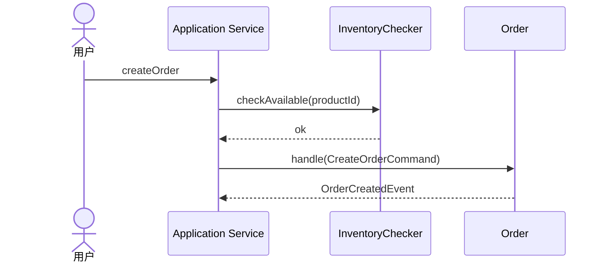

# DDD 事件风暴建模工作流

> 当 `ddd-architect` 决定进入领域建模阶段时，按照本流程输出结构化建模结果。本 skill 只负责方法步骤、检查点与逻辑产物，不负责文件落盘。

## 执行前提

- 输入应为已完成高优先级澄清的业务需求；若仍有中低优先级歧义，可带着待确认问题继续推进
- 如果执行中发现新的关键歧义，输出待确认问题，由 `ddd-architect` 统一向用户追问；不要在本 skill 内直接切换为自由问答流程
- 当阶段 7 需要补充 `application-model.md` 中的一致性要求、执行方式、外部协作类型、并发冲突语义与失败语义时，按需加载 `ddd-application-orchestration-modeling`
- 当需要补充事件风暴分析视角时，可按需加载 `ddd-event-storming`；但本 skill 仍是阶段 1-7 的执行 owner

---

## 与 `ddd-architect` 的阶段映射

阶段映射表由 `ddd-architect.md` `## 执行流程（阶段 Owner 路由表）` 统一维护，本 skill 不再维护副本。

本 skill 只负责阶段 1-7 的内部执行细则。阶段名称、阶段数量、Owner 如有调整，以 `ddd-architect.md` 为准。

---

## 强制执行流程（7 个内部阶段，必须按顺序）

### 阶段 1：需求分析与术语澄清

**目标**：抽取业务目标、业务术语、参与者、外部系统、子域边界、查询场景与关键约束，形成可继续建模的统一语义输入。

**执行规则**：
1. 提炼业务目标、核心场景、成功结果与关键异常场景
2. 识别业务术语，统一同义词、别名和上下文含义
3. 识别参与者（Actor）与外部系统，明确它们在业务中的职责
4. **识别限界上下文 / 子域**：根据业务意图划分子域边界。单子域需求可推迟识别，但多业务能力线的需求必须在本阶段明确识别并命名。子域主要依据：问题域独立性、术语不同、状态机不同、生命周期独立性。
5. **识别查询场景**：面向用户的查询需求与命令需求同等重要；后续阶段 7 识别读模型时以本阶段查询场景为输入。
6. 识别显式或隐含的触发条件、时序约束与查询需求
7. 将无法在当前阶段确定的问题列入待确认问题，不凭空补齐

**输出格式**：
```markdown
## 需求摘要
- 业务目标：
- 核心场景：
- 成功结果：

## 限界上下文 / 子域清单
| 子域名称 | 业务职责 | 与其他子域关系 |
|----------|---------|--------------|
| identity | 身份与账号，含验证码与账号状态 | 上游：依赖消息通道 |
| order    | 下单与支付 | 下游：使用 identity 提供的用户 ID |

若本轮建模仅覆盖单个子域，可明确声明"本次建模子域：{名称}"，但仍需以一句话说明为何不跨子域。

## 业务术语
| 术语 | 定义 | 备注 |
|------|------|------|
| 订单 | 用户一次购买行为对应的业务对象 | 与购物车区分 |

## 参与者与外部系统
| 类型 | 名称 | 作用 |
|------|------|------|
| Actor | 用户 | 发起下单、支付、取消 |
| 外部系统 | 支付平台 | 接收支付请求并返回支付结果 |

## 查询场景清单（读模型输入）
| 编号 | 查询场景 | 使用者 | 预期返回内容 | 预期类型 |
|------|---------|---------|--------------|---------|
| QS1  | 查看订单列表 | 用户 | 订单号、状态、金额 | 列表 |
| QS2  | 查看订单详情 | 用户 | 商品、收货地址、支付信息 | 详情 |

若本轮需求不包含查询，明确填入"无查询场景，阶段 7 读模型清单将声明为「无读模型」"。

## 待确认问题
- Q1：库存校验发生在下单前还是支付前？
```

**阶段 1 检查点**：
- [ ] 业务目标和核心场景已明确
- [ ] 关键业务术语已统一
- [ ] 参与者与外部系统已识别
- [ ] 子域 / 限界上下文已明确（单子域需显式声明）
- [ ] 查询场景已识别或明确"无查询需求"
- [ ] 已输出待确认问题，供 `ddd-architect` 统一追问

---

### 阶段 2：识别领域事件

**目标**：从需求中提取所有已发生的业务事实。

**执行规则**：
1. 逐句分析需求，找出所有“发生了什么”
2. 每个事件必须用完成时态命名，并附带英文类名（`Event` 后缀），如“已创建订单 (`OrderCreatedEvent`)”
3. 事件必须代表对解决问题有用的业务事实
4. 不要遗漏隐含事件（如“下单成功”往往隐含“已创建订单”）
5. 标注事件间的时序关系

**输出格式**：
```markdown
## 领域事件清单

| 编号 | 事件名称 | 类名 | 业务含义 | 前置事件 |
|------|---------|------|---------|---------|
| E1   | 已创建订单 | OrderCreatedEvent | 用户成功下单 | - |
| E2   | 已支付订单 | OrderPaidEvent | 订单支付完成 | E1 |
| ...  | ...     | ...  | ...     | ...     |
```

**阶段 2 检查点**：
- [ ] 所有事件都用完成时态
- [ ] 每个事件都有明确的业务含义
- [ ] 事件间时序关系已标注
- [ ] 若存在事件遗漏风险，已输出待确认问题给 `ddd-architect`

---

### 阶段 3：识别领域命令与 Actor

**目标**：找出触发每个领域事件的命令，以及命令触发者。

**执行规则**：
1. 对每个领域事件反向推导：是什么动作导致了这个事件
2. 命令用祈使句命名，并附带英文类名（`Command` 后缀），如“创建订单 (`CreateOrderCommand`)”
3. 标注命令的触发者（Actor）：用户、系统、外部系统、定时任务等
4. 一个命令成功执行必定产生至少一个领域事件
5. 识别命令所需的输入数据（命令参数）
6. 识别命令的前置条件：执行此命令前必须满足什么业务条件
7. 对无法判断的命令来源、触发者或前置条件，输出待确认问题

**输出格式**：
```markdown
## 领域命令清单

| 编号 | 命令名称 | 类名 | 触发者 | 输入数据 | 前置条件 | 产生事件 |
|------|---------|------|--------|---------|---------|---------|
| C1   | 创建订单 | CreateOrderCommand | 用户 | 商品列表、收货地址 | 商品库存充足 | E1 |
| C2   | 支付订单 | PayOrderCommand | 用户 | 订单号、支付方式 | 订单状态为未支付 | E2 |
| C3   | 取消订单 | CancelOrderCommand | 用户 | 订单号 | 订单状态为未支付；不可重复取消 | E3 |
| ...  | ...     | ...  | ...    | ...     | ...     | ...     |

## 待确认问题
- Q1：超时未支付订单由定时任务取消，还是由用户手动取消？
```

**阶段 3 检查点**：
- [ ] 每个事件都有对应的命令或明确的外部来源
- [ ] 每个命令都有明确的触发者、输入数据和前置条件
- [ ] 已输出待确认问题，供 `ddd-architect` 统一追问

---

### 阶段 4：识别 Policy

**目标**：找出“当某事件发生时，自动触发某命令”的业务规则，并区分自动化策略与聚合内部规则。

**执行规则**：
1. 对每个领域事件检查：该事件发生后是否需要自动触发其他动作
2. Policy 表达语义：“每当 [事件] 发生时，执行 [命令]”
3. Policy 必须监听领域事件，并触发已识别的领域命令；若触发动作还不是命令，标记为待补充命令或预留动作
4. 区分必然规则（聚合内部逻辑）和策略规则（Policy）
5. 如果 Policy 需要根据状态判断，标注为“有状态 Policy”（可能需要 `Saga` / 流程管理器）
6. 识别 Policy 链路中的递归触发风险
7. 对无法判断的自动化条件、触发命令或状态依赖，输出待确认问题

**输出格式**：
```markdown
## Policy 清单

| 编号 | 策略名称 | 类名 | 监听事件 | 触发命令 | 业务规则描述 | 是否有状态 |
|------|---------|------|---------|---------|-------------|-----------|
| P1   | 支付后通知发货 | NotifyShipmentAfterPaymentPolicy | E2 已支付订单 | 通知商家发货 | 支付成功后自动通知 | 否 |
| ...  | ...     | ...  | ...     | ...     | ...         | ... |

## 待确认问题
- Q1：支付成功后通知发货是否需要判断商家营业状态？
```

**阶段 4 检查点**：
- [ ] 所有事件都已检查是否需要 Policy
- [ ] Policy 和聚合内部规则已区分
- [ ] 每个 Policy 都明确监听事件和触发命令
- [ ] 有状态 Policy 已标注
- [ ] Policy 递归触发风险已初步识别
- [ ] 已输出待确认问题，供 `ddd-architect` 统一追问

---

### 阶段 5：聚合划分与边界优化

**目标**：基于领域事件、领域命令和 Policy，完成聚合划分、边界优化、规则归属与状态所有权收敛。

**执行规则**：
1. 基于领域事件、领域命令和 Policy，抽取候选业务对象
2. 为每个候选业务对象识别生命周期起点、关键状态变化和终态
3. 明确哪些状态由哪个业务对象拥有，避免多个对象同时宣称拥有同一事实
4. 区分规则归属：命令前置条件、聚合不变量、Policy 自动化规则、外部系统职责
5. **按事件归组**：哪些事件描述的是同一个业务对象的状态变化 → 归为同一聚合
6. **按命令归组**：哪些命令操作的是同一组数据 → 归为同一聚合
7. **字段相似度判断**：命令输入数据和事件携带数据中，字段重叠度高的 → 倾向归为同一聚合
8. **数量关系判断**：
   - 1:1 关系的对象 → 倾向合并到同一聚合
   - 1:N 关系中 N 端数量可控 → 可以在同一聚合
   - 1:N 关系中 N 端数量不可控 → 应拆分为独立聚合
9. **生命周期判断**：生命周期独立的对象优先独立建模
10. **高内聚检验**：聚合内的命令和事件之间是否存在强依赖（共享数据、互相影响）
11. **命名聚合**：用业务名词命名（如“订单”“商品”“用户”）
12. **确定聚合根**：每个聚合的入口对象
13. **确定聚合 ID**：优先使用业务 ID，没有则设计人造 ID
14. **声明 `version` 字段是否存在**：如采用乐观并发则在状态数据中列出 `version`（只说明"用于乐观并发控制"，不设计并发策略）。主动选择不采用乐观并发的聚合可不加 `version`。
15. **业务状态机约束写为聚合不变量**：如"锁定中不可登录""已提交后不可修改"等，全部作为聚合不变量；不在本阶段产出并发控制语义。

> **并发语义归属说明**：必须串行化 / 允许冲突失败重试 / 并发令牌方案 / 分布式锁选型 / 冲突处理 等并发语义，由阶段 7 加载 `ddd-application-orchestration-modeling` 补齐应用编排基线时输出，并写入 `application-model.md` `## 6. 聚合并发约束`。本阶段不输出并发语义。

**输出格式**：
```markdown
## 聚合划分依据

### 候选业务对象与生命周期
| 编号 | 候选业务对象 | 生命周期起点 | 关键状态 / 状态变化 | 生命周期终态 | 说明 |
|------|-------------|-------------|--------------------|-------------|------|
| D1 | 订单 | 创建订单 | 待支付 → 已支付 / 已取消 | 已完成 / 已关闭 | 核心交易对象 |
| D2 | 发货单 | 通知发货 | 待发货 → 已发货 → 已签收 | 已签收 | 物流履约对象 |

### 规则归属与状态所有权
| 编号 | 规则 / 状态 | 归属类型 | Owner | 说明 |
|------|-------------|----------|-------|------|
| R1 | 订单状态只能从待支付转为已支付或已取消 | 聚合不变量 | Order | 聚合内部一致性 |
| R2 | 取消订单前必须未支付 | 命令前置条件 | CancelOrderCommand | 命令执行前校验 |
| R3 | 支付成功后自动通知发货 | Policy | NotifyShipmentAfterPaymentPolicy | 跨对象自动化规则 |
| S1 | 订单状态 | 状态所有权 | Order | 其他对象只能感知，不能直接改写 |

## 聚合清单

### 聚合：订单 (Order)
- 聚合根：Order
- 聚合 ID：OrderId（业务订单号）
- 命令-事件映射（一行一条命令；`+` 表示同时产出多个事件，`/` 表示分支择一）：
  - C1 → E1
  - C2 → E2
  - C3 → E3
- 内部状态数据：商品列表、总金额、订单状态、收货地址、`version: long`（用于乐观并发控制；具体并发策略在阶段 7 由 `application-model.md` 输出）
- 领域服务：
  - OrderFactory (Factory) — 创建订单聚合
  - OrderRepository (Repository) — 订单聚合的整存整取
- 不变量（聚合始终维护的约束，包含业务状态机约束）：
  - 订单总金额 = 所有商品金额之和
  - 订单状态转换：待支付 → 已支付 / 已取消（不可逆）
  - 已支付后不可取消（业务状态机约束，不抽为独立"业务锁规则"字段）

### 聚合：...
（同上格式）
```

> **规则分工说明**：
> - 命令的“前置条件”列：描述执行该命令前必须满足的条件，面向命令触发校验
> - 聚合的“不变量”：描述聚合始终要维护的约束，面向聚合内部一致性保证

**阶段 5 检查点**：
- [ ] 主要候选业务对象已识别
- [ ] 候选对象生命周期已明确
- [ ] 关键规则归属已明确
- [ ] 关键状态所有权已明确
- [ ] 所有事件都被分配到聚合上（外部系统的除外）
- [ ] 所有命令都能被聚合或领域服务执行
- [ ] 聚合内功能高内聚，聚合间低耦合
- [ ] 每个聚合都已输出“命令-事件映射”（形如 `C1 → E1`），且覆盖该聚合的所有命令编号与所有事件编号；多事件用 `+`、多分支用 `/`
- [ ] 采用乐观并发的聚合已在状态数据中声明 `version` 字段存在
- [ ] 业务状态机约束已作为聚合不变量写出，未被误写为并发控制结论
- [ ] 并发语义本身未在本阶段产出（留给阶段 7 + `ddd-application-orchestration-modeling`）

---

### 阶段 6：完备性验证

**目标**：验证模型逻辑自洽、可被实现，并将发现的问题回退到对应阶段修正。

**执行以下检查**：

#### 6.1 事件命令完备性
- [ ] 所有事件都有来源（命令或外部系统）
- [ ] 所有命令执行需要的信息都能来自命令参数或历史事件
- [ ] 所有读模型（用户需要看到的数据）都能通过领域事件构建

#### 6.2 读模型完备性
- [ ] 所有查询场景都有对应的读模型（或可直接从聚合查询）
- [ ] 每个读模型的数据来源事件已明确
- [ ] 读模型的更新时机已明确（同步 / 异步）
- [ ] 读模型不包含业务逻辑，只负责数据展示

#### 6.3 聚合完备性
- [ ] 所有事件都被分配到聚合（外部系统除外）
- [ ] 所有聚合的状态都可通过其历史事件重建
- [ ] 所有命令的功能都可被聚合或领域服务完成

#### 6.4 聚合合理性
- [ ] 聚合不会太大导致性能问题
- [ ] 聚合不会太零碎导致高耦合泄露到外部

#### 6.5 并发字段完备性（领域侧）
- [ ] 采用乐观并发的聚合都已在状态数据中声明 `version` 字段存在
- [ ] 采用整存整取的聚合没有遗漏更新丢失风险
- [ ] 业务状态机约束作为聚合不变量表达，没有被误当成技术并发控制
- [ ] 高争用对象没有被错误塞进过大的聚合边界
- [ ] 并发语义本身的完备性由阶段 7 调用 `ddd-application-orchestration-modeling` 完成，不在本阶段判定

#### 6.6 聚合协作清晰性
- [ ] 每条跨聚合协作都已声明上游 / 下游、触发点、协作载体、发起层、一致性
- [ ] 已区分“运行时协作入口”与“事实来源事件”
- [ ] 已区分聚合之间协作、Policy 自动化和外部系统协作

#### 6.7 Policy 递归风险检查
- [ ] 每个 Policy 触发的命令不会产生被同一 Policy 监听的事件（直接递归）
- [ ] 多个 Policy 之间不存在循环触发（间接递归）：`Policy A → Command X → Event Y → Policy B → Command Z → Event W → Policy A`
- [ ] 所有 Policy 链路都有明确的终止条件（业务逻辑保证不会无限循环）

#### 6.8 问题归属 → 回退阶段映射

验证不通过时，按以下映射决定回退到哪个阶段，不要"原地修"事后阶段产物。

| 发现的问题类型 | 回退阶段 | 原因 |
|----------------|---------|------|
| 子域 / 限界上下文误划、术语冲突、参与者遗漏 | 阶段 1 | 上游语义输入错误 |
| 查询场景遗漏、读模型无法从领域事件构建 | 阶段 1 → 阶段 7 | 查询场景未在阶段 1 提前识别，需补充后重出读模型 |
| 遗漏业务事实 / 事件名称不是完成时态 / 事件时序错误 | 阶段 2 | 事件列表不完备 |
| 命令缺少触发者 / 参数 / 前置条件不足 | 阶段 3 | 命令与事件未对齐 |
| Policy 递归、状态 Policy 未标注、Policy 触发动作未建模为命令 | 阶段 4 | 自动化规则未收敛 |
| 聚合边界错误、状态所有权不清、不变量遗漏、聚合过大 / 过零碎 | 阶段 5 | 边界优化不到位 |
| 聚合协作发起层不明、一致性语义与实际能力冲突 | 阶段 5 | 协作矩阵不完整 |
| 并发语义、事务边界、外部协作类型、失败语义与业务需求冲突 | 阶段 7 + `ddd-application-orchestration-modeling` | 应用编排语义问题 |
| `version` 字段遗漏 / 被错误提升为并发策略 | 阶段 5 + 阶段 7 | 领域侧只补字段，并发策略补到应用侧 |

**如果验证不通过**：按上表定位回退阶段，修正后重新走后续阶段检查点；不可跳过验证。

---

### 阶段 7：输出逻辑产物包

**目标**：输出结构化的完整建模结果，作为 `ddd-architect` 后续落盘和 `ddd-coding-workflow` 后续消费的逻辑输入。

> 阶段 7 输出的是逻辑产物包，由 `ddd-architect` 结合 `ddd-artifact-contract` 映射到四份建模文档；本 skill 不负责任何文件落盘细节。

> 当阶段 7 需要补充 `application-model.md` 中的一致性要求、执行方式、外部协作类型、并发冲突语义与失败语义时，按需加载 `ddd-application-orchestration-modeling`；本 skill 不重复维护该部分判定细则。

**最终输出必须包含**：
1. 需求摘要、业务术语、参与者与外部系统
2. 限界上下文 / 子域清单（单子域要求显式声明）
3. 查询场景清单（本阶段不生成读模型详细设计，但作为读模型清单的输入）
4. 领域事件清单（含字段）
5. 领域命令清单（含参数、前置条件、Actor）
6. Policy 清单
7. 聚合划分依据（候选业务对象、生命周期、规则归属、状态所有权）
8. 聚合设计与边界决策（含聚合根、ID、命令-事件映射（形如 `C1 → E1`）、状态数据含 `version` 字段说明、不变量含业务状态机约束；**不**输出并发语义 / 乐观并发令牌方案 / 分布式锁选型，这些由本阶段调用 `ddd-application-orchestration-modeling` 输出并写入 `application-model.md` `## 6. 聚合并发约束`）
9. 聚合协作约束（必须同时包含：协作原则、协作矩阵、关键协作时序；明确谁发起、通过什么载体协作、位于哪一层、采用强一致 / 最终一致 / 长流程中的哪一种）
10. 读模型清单（默认必须输出；若阶段 1 查询场景清单为空，明确输出"无读模型"状态声明，不能省略）
11. 应用编排语义（包含并发语义 / 并发令牌方案 / 事务边界 / 外部协作类型 / 执行方式 / 失败语义，由 `ddd-application-orchestration-modeling` 输出）
12. 待确认问题清单（建模过程中发现的需要和用户 / 业务方确认的问题）

### 读模型输出规范

**目标**：基于阶段 1 识别出的查询场景清单产出读模型清单。该输出由 `ddd-architect` 写入 `application-model.md` `## 8. 读模型清单`。

**执行规则**：
1. 以阶段 1 产出的「查询场景清单」为输入；不在本阶段重新发明查询场景
2. 查询场景清单为空时，读模型清单输出"本子域读模型状态：无读模型"，并说明原因。禁止省略该章节
3. 为每个查询场景设计一个读模型
4. 读模型命名：用业务术语 + "视图 / 列表 / 详情"，如"订单列表视图 (`OrderListView`)"
5. 明确读模型的数据来源：由哪些领域事件构建；若不能从领域事件构建，说明是领域模型遗漏，需回退阶段 2/5
6. 明确读模型的更新时机：同事务同步 / 本地异步 / 远程异步
7. 标注读模型的存储方式：内存、数据库、缓存、搜索引擎等

**输出格式**：
```markdown
## 读模型清单

本子域读模型状态：{无读模型 / 以下有读模型}

| 编号 | 读模型名称 | 类名 | 查询场景（来自阶段 1 查询场景清单） | 数据来源事件 | 更新时机 | 存储方式 | 关键字段 |
|------|-----------|------|---------|-------------|---------|---------|---------|
| R1   | 订单列表视图 | OrderListView | QS1 | E1 OrderCreatedEvent, E2 OrderPaidEvent, E3 OrderCancelledEvent | 本地异步 | 数据库 | 订单号、状态、金额、创建时间 |
| R2   | 订单详情视图 | OrderDetailView | QS2 | E1 OrderCreatedEvent, E2 OrderPaidEvent | 本地异步 | 数据库 | 订单号、商品列表、收货地址、支付方式 |
| ...  | ...       | ...  | ...     | ...         | ...     | ...     | ...     |
```

**读模型设计原则**：
- 读模型是非规范化的，可以冗余数据以优化查询性能
- 读模型不包含业务逻辑，只负责数据展示
- 读模型可以跨聚合边界组合数据
- 读模型的更新可以异步进行，允许最终一致性
- 如果查询场景简单，可以直接从聚合查询，不需要单独的读模型

**默认行为**：
- 阶段 1 查询场景清单有内容 → 本阶段必须产出一份读模型清单
- 阶段 1 明确声明无查询 → 本阶段产出"无读模型"状态声明，不能省略

---

### 聚合协作约束输出规范

当存在两个及以上独立聚合时，不能只写“聚合 A 影响聚合 B”，必须至少从以下 3 个层次表达：

1. **协作原则**：说明是否允许直接引用、允许的协作方式、禁止做什么
2. **协作矩阵**：逐条列出协作关系
3. **关键协作时序**：对关键用例给出编号步骤或 Mermaid `sequenceDiagram`

如需表达状态 / 数据拥有权，将其并入协作原则、规则归属说明或协作矩阵的说明列中，不再单列固定章节。

**推荐格式**：

````markdown
## 聚合协作约束

### 协作原则
- `Order` 与 `Inventory` 都是独立聚合，不直接持有对方对象引用，只允许持有对方 ID。
- 跨聚合状态推进只能通过应用层编排、领域事件、Policy 或 Saga 完成。
- 若要求跨两个聚合单事务强一致写入，先回到建模重新检查聚合边界。
- 库存余额由 `Inventory` 拥有，`Order` 只能通过校验接口或事件感知该事实。

### 协作矩阵

| 协作编号 | 上游聚合 | 下游聚合 | 触发点 / 用例 | 协作载体 | 发起层 | 一致性 | 失败语义 | 说明 |
|----------|----------|----------|---------------|----------|--------|--------|----------|------|
| COL-1 | Order | Inventory | `CreateOrderCommand` | `ProductId` + `InventoryChecker` | 应用层 / 领域端口 | 单聚合写入强一致；跨聚合只做校验 | 库存不足则拒绝下单 | `Order` 不直接修改 `Inventory` |
| COL-2 | Order | Shipment | `OrderPaidEvent` | 领域事件 + Policy | 提交后策略 | 最终一致 | 重试直到成功 | `Shipment` 不回写 `Order` |

### 关键协作时序


````

**额外约束**：
- 必须区分“运行时协作入口”和“事实来源事件”
- 必须标明协作发生在聚合内 / 应用层 / Policy / Saga 哪一层
- 必须标明一致性：单事务强一致 / 提交后最终一致 / 长流程
- 如果结论是“无直接关系”，也要写明为什么无直接关系

---

## 核心原则（贯穿全流程）

### 流程原则

- **顺序执行**：必须按 `1 → 2 → 3 → 4 → 5 → 6 → 7` 顺序执行
- **显式输出**：每个阶段都必须显式输出结果，不能在“脑中”完成
- **门控推进**：每个阶段的检查点全部满足后，才能进入下一阶段
- **允许回退**：阶段 6 或阶段 7 发现问题时，回退到受影响阶段重新执行，但对用户可见流程仍保持顺序推进

### 建模原则

- **事件优先**：始终从业务事实出发，不从数据表或技术实现出发
- **先事实与规则归属后边界优化**：先完成事件、命令、Policy、业务对象、生命周期、规则归属等语义收敛，再做聚合拆分与边界优化
- **聚合由功能定义**：聚合不是数据库表，而是承担高内聚业务能力的对象
- **`domain-model.md` 保持纯领域**：只记录领域最终结论，不记录应用编排和代码实现细节
- **应用编排单独沉淀**：应用服务、用例编排、事务语义进入 `application-model.md`
- **规则双标注**：前置条件标在命令，不变量标在聚合，两者不重复
- **数量关系影响边界**：1:N 关系中 N 端数量不可控时，优先拆分独立聚合
- **生命周期决定边界**：生命周期独立的对象优先独立建模
- **业务状态机约束写为聚合不变量，不写为并发控制**：业务上"锁定不可改""已提交后不可修改"等约束放到聚合不变量；技术上的并发语义（必须串行化 / 允许冲突失败重试 / 并发令牌方案 / 分布式锁）由应用编排输出
- **不确定就问**：遇到模糊逻辑时，列入待确认问题，不凭空补齐

### 职责边界原则

- **建模决策先于编码决策**：不能用代码方便性倒推聚合边界
- **发现文档和决策文档分离**：头脑风暴过程不污染最终基线
- **实现约束只记语义，不记方案**：可以写“必须强一致”“允许延迟完成”，不能直接写成具体框架实现
- **应用编排不等于代码实现**：`application-model.md` 只回答用例如何编排，不回答类如何实现

---

## 变更标记规则（迭代建模时使用）

当用户在已有建模结果基础上追加或修改需求时，必须在受影响的建模对象上标记变更类型：

- **（新）**：本轮新增的建模对象（事件、命令、Policy、聚合）
- **（改）**：本轮修改了的已有建模对象

未标记的：本轮未变动的已有对象

**标记位置**：紧跟在对象名称后面

**示例**：
```markdown
| E1   | 已创建订单 | 用户成功下单 | - |
| E2   | 已支付订单（改） | 订单支付完成，新增支付渠道字段 | E1 |
| E5   | 已退款订单（新） | 订单退款成功 | E2 |
```

**规则**：
- 首次建模时不需要标记（全部都是新的）
- 仅在用户追加 / 修改需求触发的迭代轮次中标记
- 每轮迭代结束后，下一轮的标记基于上一轮的最终结果
- 交付给 `ddd-architect` 的最终逻辑产物应去掉这些标记，只保留最终状态
