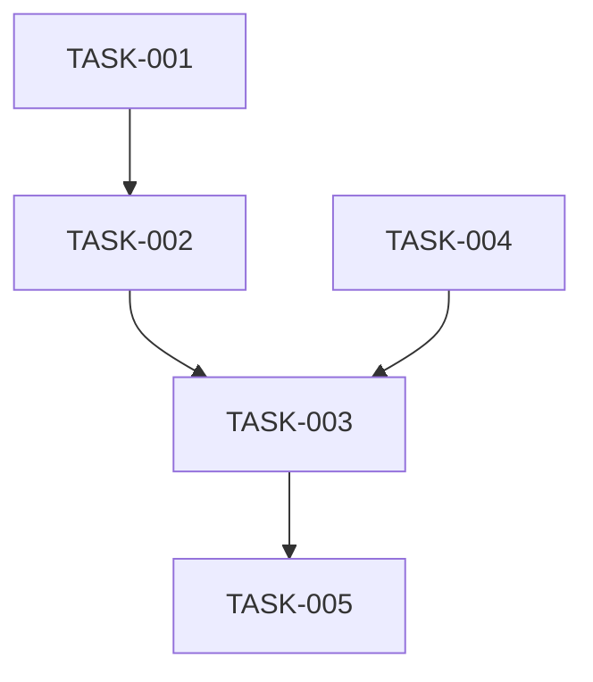

# OpenSpec 文档结构契约

> 本文档统一维护 OpenSpec 三个核心 artifacts 的结构模板、字段约束和内容归属。当需要创建、调整或校验文档结构时，参考此契约。

## 适用范围

- 首次创建 OpenSpec change 的 artifacts
- 调整 artifacts 的章节结构和字段约束
- 校验建模结果是否写入了正确文档
- 多次迭代时，统一约束章节更新方式

## 文件清单

OpenSpec 标准工作流涉及三个核心 artifacts：

- `proposal.md` - 需求澄清与第一性原理分析
- `design.md` - 方案设计与交叉验证
- `tasks.md` - 任务拆解与验收标准

## 内容归属矩阵

本矩阵用于自动验收产物是否写入了正确文档。每类内容只能有一个主归属文档；其他文档如需引用，只能写摘要或引用关系，不重复维护完整定义。

| 内容项 | 必须写入文档 | 必须章节 / 位置 | 不应写入 | 验收规则 |
|--------|--------------|----------------|----------|----------|
| **Phase 1 产物** | | | | |
| 业务目标、核心场景、成功标准 | `proposal.md` | `## 业务目标` | `design.md`, `tasks.md` | 必须可量化 |
| 第一性原理分析（表面需求 vs 底层问题） | `proposal.md` | `## 第一性原理分析` | `design.md`, `tasks.md` | 必须区分表面需求与底层问题 |
| 基本约束（物理/业务/资源） | `proposal.md` | `## 第一性原理分析 > 基本约束` | `design.md`, `tasks.md` | 至少识别 1 个约束 |
| 必要性验证（不做会怎样/做了能带来什么） | `proposal.md` | `## 第一性原理分析 > 必要性验证` | `design.md`, `tasks.md` | 必须量化 |
| 范围界定（in-scope / out-of-scope） | `proposal.md` | `## 范围` | `design.md`, `tasks.md` | 必须明确边界 |
| Phase 1 待确认问题 | `proposal.md` | `## 待确认问题` | `design.md`, `tasks.md` | 高优先级问题必须标记 blocking |
| **Phase 2 产物** | | | | |
| 候选方案清单（至少 2 个） | `design.md` | `## 候选方案` | `proposal.md`, `tasks.md` | 至少 2 个有实质差异的方案 |
| 候选方案交叉验证矩阵 | `design.md` | `## 候选方案交叉验证矩阵` | `proposal.md`, `tasks.md` | 必须包含成本/性能/复杂度/风险四维 |
| 推荐方案及决策依据 | `design.md` | `## 推荐方案及决策依据` | `proposal.md`, `tasks.md` | 必须回答"为什么不选其他方案" |
| 回溯第一性原理验证 | `design.md` | `## 推荐方案及决策依据 > 回溯第一性原理验证` | `proposal.md`, `tasks.md` | 必须验证是否解决 Phase 1 底层问题 |
| 架构设计（系统架构图、组件、数据流） | `design.md` | `## 架构设计` | `proposal.md`, `tasks.md` | 必须包含架构图 |
| 关键设计决策 | `design.md` | `## 设计细节` | `proposal.md`, `tasks.md` | 数据模型、接口、并发、事务、错误处理 |
| 边界场景处理 | `design.md` | `## 边界场景处理` | `proposal.md`, `tasks.md` | 异常、并发、边界、降级 |
| 非功能性需求 | `design.md` | `## 非功能性需求` | `proposal.md`, `tasks.md` | 性能、可用性、扩展性、安全性 |
| 被否决方案 | `design.md` | `## 被否决方案` | `proposal.md`, `tasks.md` | 必须说明否决理由 |
| Phase 2 待确认问题 | `design.md` | `## 设计决策待确认` | `proposal.md`, `tasks.md` | 影响设计的问题 |
| **Phase 3 产物** | | | | |
| 任务清单（拆解后的任务） | `tasks.md` | `## 任务清单` | `proposal.md`, `design.md` | 每个任务有验收标准 |
| 验收标准 | `tasks.md` | 每个任务内的 `验收标准` | `proposal.md`, `design.md` | 必须满足 SMART 原则 |
| 任务依赖关系 | `tasks.md` | `## 任务依赖` 或每个任务内 | `proposal.md`, `design.md` | 前置、阻塞、并行关系 |
| 实施风险 | `tasks.md` | `## 实施风险` | `proposal.md`, `design.md` | 技术/依赖/时间/质量风险 |
| 测试策略 | `tasks.md` | `## 测试策略` | `proposal.md`, `design.md` | 单元/集成/性能测试 |
| 里程碑与交付物 | `tasks.md` | `## 里程碑` | `proposal.md`, `design.md` | 时间节点、交付物、验收 |
| Phase 3 待确认问题 | `tasks.md` | `## 实施风险` | `proposal.md`, `design.md` | 实施细节问题 |

## 模板：`proposal.md`

```markdown
# {Change 名称} - 需求提案

> 最后更新：{日期}
> 状态：Phase 1 - 需求澄清

## 业务目标

- **业务目标**：{一句话描述用户真正想要达成的业务结果}
- **核心场景**：
  - 场景 1：{描述}
  - 场景 2：{描述}
- **成功标准**：
  - 标准 1：{可量化指标}
  - 标准 2：{可量化指标}

## 第一性原理分析

### 表面需求 vs 底层问题

- **用户提出的需求**：{用户原始表述}
- **真正要解决的问题**：{追问 5 个为什么后的本质问题}
- **是否存在需求误解**：{表面需求与底层问题的差异分析}

### 基本约束（不可绕过的事实）

| 约束类型 | 具体约束 | 影响 |
|---------|---------|------|
| 物理约束 | {如：网络延迟下界、存储 IOPS 上限} | {对方案的限制} |
| 业务约束 | {如：监管要求、SLA 承诺、遗留系统兼容} | {对方案的限制} |
| 资源约束 | {如：团队规模、时间窗口、预算上限} | {对方案的限制} |

### 必要性验证

- **不做会怎样**：{现状痛点的量化影响}
- **做了能带来什么**：{预期收益的量化目标}
- **是否有更简单的替代方案**：
  - {替代方案 1}：{为什么不选}
  - {替代方案 2}：{为什么不选}
- **必要性结论**：{必须做 / 有更优替代 / 建议推迟}

## 范围

### 包含范围（In Scope）
- {功能/模块 1}
- {功能/模块 2}

### 不包含范围（Out of Scope）
- {明确不包含的功能}
- {明确不包含的模块}

### 未来考虑（Future Considerations）
- {未来可能考虑的扩展}

## 利益相关方

| 角色 | 关注点 |
|------|--------|
| {角色 1} | {关注点列表} |
| {角色 2} | {关注点列表} |

## 待确认问题

| 编号 | 问题描述 | 优先级 | 状态 | 影响 |
|------|---------|--------|------|------|
| Q1 | {具体问题} | 高/中/低 | 待确认/已确认 | {影响的方面} |

---

**Phase 1 检查点**：
- [ ] 第一性原理分析完整
- [ ] 至少识别 1 个基本约束
- [ ] 必要性量化验证完成
- [ ] 高优先级问题已全部回答
```

## 模板：`design.md`

```markdown
# {Change 名称} - 设计方案

> 最后更新：{日期}
> 状态：Phase 2 - 方案设计
> 依赖：proposal.md

## 设计目标

基于 proposal.md 的底层问题分析，本方案需要解决：
- {从 Phase 1 提取的底层问题}

关键约束：
- {从 Phase 1 提取的关键约束}

## 候选方案

### 方案 A：{方案名称}

**核心思路**：{一句话描述}

**架构概览**：
```
{架构图或关键组件描述}

**技术栈**：
- {技术 1}
- {技术 2}

**数据流**：
{数据流转描述}

**关键实现细节**：
- {实现要点 1}
- {实现要点 2}

### 方案 B：{方案名称}

{同方案 A 格式}

### 方案 C：{方案名称}（可选）

{同方案 A 格式}

## 候选方案交叉验证矩阵

| 维度 | 方案 A | 方案 B | 方案 C（可选） |
|------|--------|--------|--------------|
| **成本** | {开发成本 + 资源成本} | {开发成本 + 资源成本} | {开发成本 + 资源成本} |
| **性能** | {响应时间 / QPS / 资源消耗} | {响应时间 / QPS / 资源消耗} | {响应时间 / QPS / 资源消耗} |
| **复杂度** | {开发/测试/运维复杂度} | {开发/测试/运维复杂度} | {开发/测试/运维复杂度} |
| **风险** | {技术/扩展/依赖/业务风险} | {技术/扩展/依赖/业务风险} | {技术/扩展/依赖/业务风险} |

## 推荐方案及决策依据

- **推荐**：方案 {X}（{方案名称}）
- **决策依据**：
  1. {理由 1}
  2. {理由 2}
  3. {理由 3}

- **为什么不选方案 A**：
  - {具体理由}

- **为什么不选方案 B**：
  - {具体理由}

- **回溯第一性原理验证**：
  - Phase 1 的底层问题：{底层问题}
  - 推荐方案如何解决：{解决方式}
  - ✓/✗ 推荐方案与底层问题匹配

## 架构设计

### 系统架构图

```mermaid
{Mermaid 架构图}
```

或

```
{ASCII 架构图}
```

### 核心组件

| 组件 | 职责 | 接口 |
|------|------|------|
| {组件 1} | {职责描述} | {接口列表} |
| {组件 2} | {职责描述} | {接口列表} |

### 数据流转

{详细描述数据如何在组件间流转}

## 设计细节

### 数据模型

{数据库表设计、字段、索引、关系}

### 接口设计

#### API 1：{接口名称}

- **请求**：{请求格式}
- **响应**：{响应格式}
- **错误码**：{错误码列表}

### 并发控制

{乐观锁 / 悲观锁 / 分布式锁策略}

### 事务边界

{哪些操作在同一事务内，哪些跨事务}

### 错误处理

{异常场景处理策略、重试、降级}

### 监控告警

{关键指标、告警规则}

## 边界场景处理

| 场景类型 | 具体场景 | 处理方式 |
|---------|---------|---------|
| 异常场景 | {如：超时、失败、重试} | {处理策略} |
| 并发场景 | {如：多人同时操作} | {处理策略} |
| 边界场景 | {如：空数据、超大数据} | {处理策略} |
| 降级场景 | {如：依赖不可用} | {降级方案} |

## 非功能性需求

- **性能指标**：{如：响应时间 < 100ms，QPS > 1000}
- **可用性指标**：{如：99.9% 可用性}
- **可扩展性**：{如：支持水平扩展}
- **安全性**：{如：认证 / 授权 / 数据加密}

## 被否决方案

### 方案 X：{方案名称}

- **方案描述**：{简要描述}
- **否决理由**：
  1. {理由 1}
  2. {理由 2}
- **否决时间**：{日期}

## 设计决策待确认

| 编号 | 问题描述 | 优先级 | 状态 | 影响 |
|------|---------|--------|------|------|
| Q2 | {具体问题} | 高/中/低 | 待确认/已确认 | {影响的设计决策} |

---

**Phase 2 检查点**：
- [ ] 至少 2 个候选方案
- [ ] 四维对比矩阵完整
- [ ] 推荐方案回溯验证 Phase 1
- [ ] 设计细节完整

## 模板：`tasks.md`

```markdown
# {Change 名称} - 实施计划

> 最后更新：{日期}
> 状态：Phase 3 - 任务拆解
> 依赖：design.md

## 任务清单

### TASK-001: {任务名称}

**描述**：
{详细描述做什么}

**优先级**：P0 / P1 / P2 / P3

**预估工作量**：{人日}

**验收标准**：
- [ ] {验收标准 1}
- [ ] {验收标准 2}
- [ ] {验收标准 3}

**依赖关系**：
- 前置任务：{TASK-XXX}
- 阻塞任务：{TASK-YYY}
- 并行任务：{TASK-ZZZ}

**风险识别**：
- {风险描述}：{缓解措施}

**负责人**：{姓名（可选）}

**状态**：待开始 / 进行中 / 已完成

---

### TASK-002: {任务名称}

{同 TASK-001 格式}

## 任务依赖关系

```
TASK-001
    ↓
TASK-002
    ↓
TASK-003 ← TASK-004 (并行)
    ↓
TASK-005
```

或



## 实施风险

| 风险 ID | 风险描述 | 风险等级 | 影响 | 缓解措施 | 负责人 |
|---------|---------|---------|------|---------|--------|
| RISK-001 | {风险描述} | 高/中/低 | {影响} | {缓解措施} | {姓名} |

## 测试策略

### 单元测试
- **目标覆盖率**：> 80%
- **重点测试**：
  - {测试点 1}
  - {测试点 2}

### 集成测试
- **测试场景**：
  - 场景 1：{描述}
  - 场景 2：{描述}

### 性能测试
- **测试场景**：
  - 场景 1：{目标}
  - 场景 2：{目标}

## 里程碑

### 里程碑 1：{名称}
- **目标日期**：{日期或时间范围}
- **交付物**：{交付物列表}
- **验收标准**：{验收条件}

### 里程碑 2：{名称}
{同里程碑 1 格式}

---

**Phase 3 检查点**：
- [ ] 任务拆解覆盖所有设计要点
- [ ] 每个任务有明确验收标准
- [ ] 依赖关系清晰
- [ ] 风险识别完整

## 文档更新规则

### 首次创建

按模板创建完整文档，所有必填章节都必须包含。

### 迭代更新

- 只更新受影响的章节
- 保留无关内容
- 在文档头部更新"最后更新"时间
- 不在文档内部标记（新）（改），依赖 git 追踪变更

### 跨阶段引用

- 后续阶段可以引用前置阶段的内容
- 引用方式：`参见 proposal.md ## 第一性原理分析`
- 不重复维护相同内容

## 文档完整性验证

### proposal.md 完整性

- [ ] 业务目标已明确
- [ ] 第一性原理分析完整（表面需求 vs 底层问题 / 基本约束 / 必要性验证）
- [ ] 范围界定清晰（in-scope / out-of-scope）
- [ ] 高优先级问题已全部回答

### design.md 完整性

- [ ] 至少 2 个候选方案
- [ ] 四维对比矩阵完整
- [ ] 推荐方案回溯验证 Phase 1
- [ ] 架构设计包含架构图
- [ ] 设计细节覆盖数据模型、接口、并发、事务、错误处理
- [ ] 边界场景处理完整

### tasks.md 完整性

- [ ] 任务拆解覆盖所有设计要点
- [ ] 每个任务有验收标准
- [ ] 验收标准满足 SMART 原则
- [ ] 任务依赖关系清晰
- [ ] 风险识别完整
- [ ] 测试策略完整

## 总结

OpenSpec 文档结构契约的核心价值是**单一真相源**。通过统一维护文档结构和内容归属，避免多处重复定义，确保文档质量和一致性。

**核心原则**：每类内容只有一个主归属文档，跨文档引用而非重复维护。
